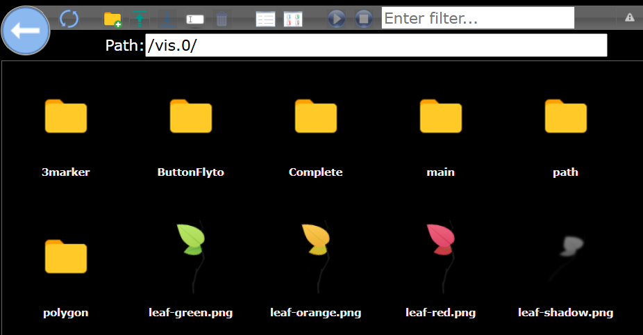
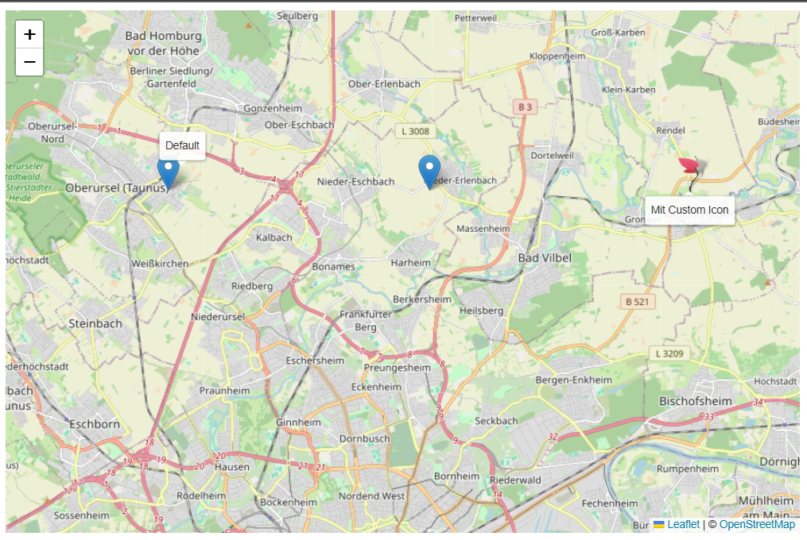
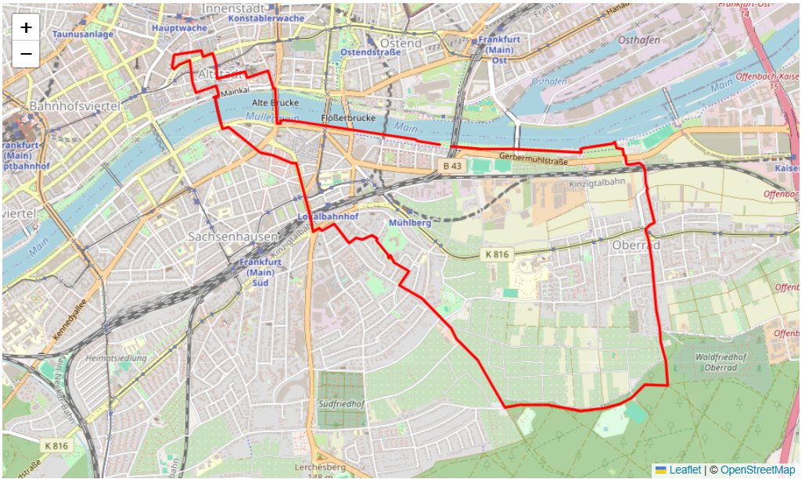
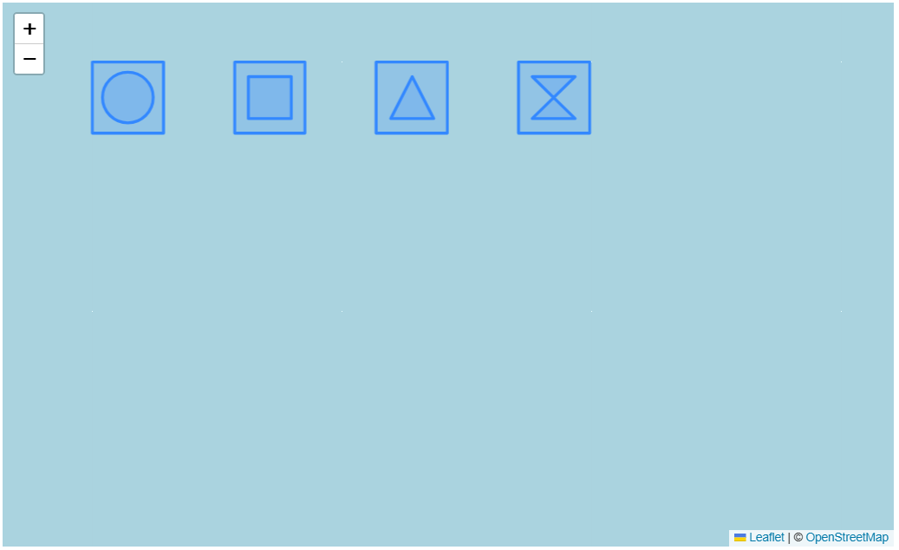
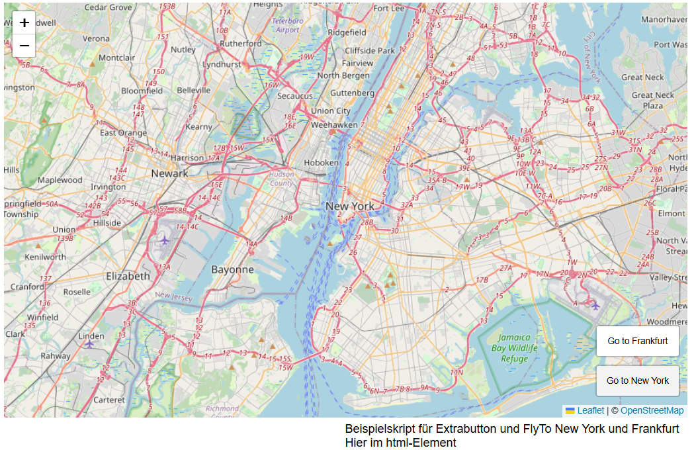
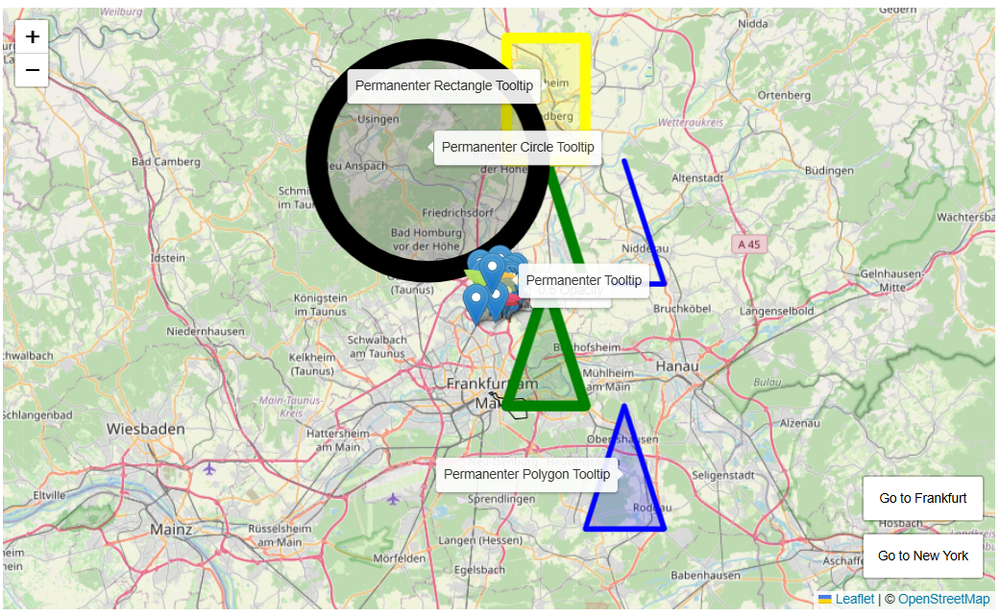
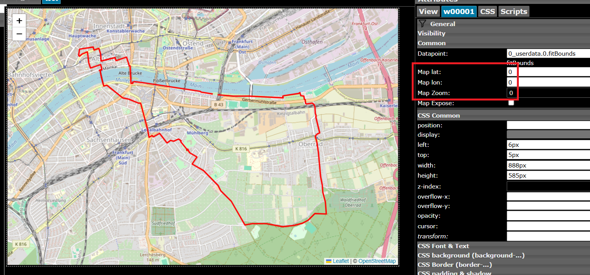
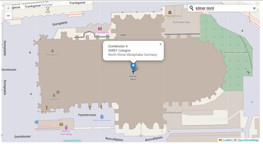
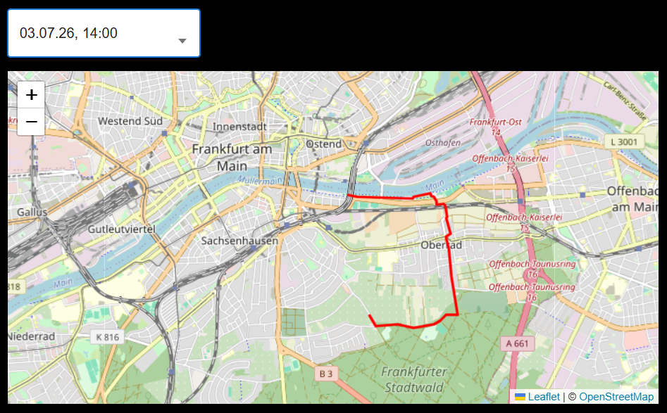

# Examples for mapwidgets

Preperation for test.

Please import the images in the test-images directory to /vis.0/



## Directory Example3MarkersJSON

The datapoint contains 3 Markers in different configurations.

To test:

- Create datapoint of type string in userdata.0.3Marker
- copy contents of file datapoint-userdata.0.3Marker.json to the datapoint
- Import project zip-file into vis and open it.



## Directory ExamplePathJSON

The datapoint contains a path in Frankfurt/Main

To test:

- Create datapoint of type string in userdata.0.path
- copy contents of file datapoint-userdata.0.path.json to the datapoint
- Import project zip-file into vis and open it.



## Directory ExamplePolygonJSON

The datapoint contains different type of rectangles, circle and polygons

To test:

- Create datapoint of type string in userdata.0.polygon
- copy contents of file datapoint-userdata.0.polygon.json to the datapoint
- Import project zip-file into vis and open it.



## Directory ExampleButtonFlytoScript

The Example contains a script to modify map controls with 2 buttons
to fly between Frankfurt and New York.
It also contains a usage example for the function waitFotGlobal and custom map controls.

To test:

- Import project zip-file into vis and open it.



## Directory ExampleCompleteTest

The Example contains all of the tests alltogether

To test:

- Create datapoint of type string in userdata.0.leaflet
- copy contents of file datapoint-userdata.0.leaflet.json to the datapoint
- Import project zip-file into vis and open it.



## Directory ExampleFitBoundsJSON

This example demonstrates the functionality of the "fitBounds" option using a path.
In the example project, the map center and zoom level are explicitly set to 0.
However, this behavior is overridden by the "fitBounds" option,
which centers the map on the path and calculates the optimal zoom level.

To test:

- Create datapoint of type string in userdata.0.fitBounds
- copy contents of file datapoint-userdata.0.fitBounds.json to the datapoint
- Import project zip-file into vis and open it.



## Directory ExamplePluginGeocoderScript

This example demonstrates the use of Leaflet plugins,
as well as the `loadCSS` and `loadScript` functions.
Specifically, it shows how to integrate the
[Leaflet Geocoder plugin](https://github.com/perliedman/leaflet-control-geocoder).
This example does not use a data point; however,
the "Expose" checkbox must be checked in the map settings.

To test:

- Import project zip-file into vis and open it.

After importing, you will find the following details in the script tab.

```javascript
// A separate function is required for using the 'await' keyword. Alternatively, the Promise/then notation must be used.
async function load() {
    // Use try/catch to handle errors in await functions
    try {
        // Load the CSS stylesheet as described in the plugin documentation
        await window.iobroker.mapwidgets.loadCSS(
            'https://unpkg.com/leaflet-control-geocoder/dist/Control.Geocoder.css',
        );
        // Load the javascript as described in the plugin documentation
        await window.iobroker.mapwidgets.loadScript(
            'https://unpkg.com/leaflet-control-geocoder/dist/Control.Geocoder.js',
        );
        // Wait for the map object to be created by the widget. The "Expose" option must be checked in the widget settings.
        let map = await window.iobroker.mapwidgets.waitForGlobal('iobroker.mapwidgets.w00001.map', 200, 5000);
        // // Once the map object is available, the geocoder control can be added to the map.
        new L.Control.Geocoder().addTo(map);
    } catch (e) {
        console.log(e.message);
    }
}
load();
```



## Directory ExamplePathHistory

This example demonstrates how to display a path history.
Using a selection field implemented with the `jsonTemplate` widget
(from the adapter of the same name), you can select a specific path from
an extended JSON data structure and display it in the Leaflet map widget.

The extended data structure is organized as follows:

```json
{
    "2026-07-03T12:00:00.000Z": {
        "map": {}
    },
    "2026-07-04T12:00:00.000Z": {
        "map": {}
    },
    "2026-07-05T12:00:00.000Z": {
        "map": {}
    }
}
```

Any value accepted by the `new Date()` constructor (with a single parameter)
can be used. As an example, a JavaScript timestamp or an ISO-formatted date string.
ISO format is recommended for better readability:
<https://developer.mozilla.org/de/docs/Web/JavaScript/Reference/Global_Objects/Date/Date>

The actual map data, as described in the adapter documentation,
is contained within the respective `map` attribute.

All paths should have the `fitbounds=true` option set so that the map
automatically selects the correct view area and zoom level (see example data).

A complete JSON example can be found in this file:
[ExamplePathHistoryJSON](./ExamplePathHistory/datapoint.userdata.0.pathhistory.json)

The `jsonTemplate` widget was used for the selection field:
<https://github.com/oweitman/ioBroker.vis-jsontemplate>

Select the data point containing the prepared data structure.
Use the following template:

[jsonTemplate](./ExamplePathHistory/jsonTemplate.txt)

Within this template at the beginning,
a local data point named `local_map` can optionally
be customized; however, for this example, it should remain unchanged.

Finally, simply place the Mapwidgets Leaflet widget and set `local_map` as its data point.


