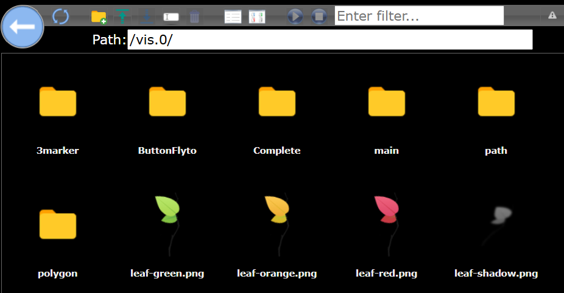

# Examples for mapwidgets

Preperation for test.

Please import the images in the test-images directory to /vis.0/

## Directory Example3MarkersJSON

The datapoint contains 3 Markers in different configurations.

To test:

- Create datapoint of type string in userdata.0.3Marker
- copy contents of file datapoint-userdata.0.3Marker.json to the datapoint
- Import project zip-file into vis and open it.

## Directory ExamplePathJSON

The datapoint contains a path in Frankfurt/Main

To test:

- Create datapoint of type string in userdata.0.path
- copy contents of file datapoint-userdata.0.path.json to the datapoint
- Import project zip-file into vis and open it.

## Directory ExamplePolygonJSON

The datapoint contains different type of rectangles, circle and polygons

To test:

- Create datapoint of type string in userdata.0.polygon
- copy contents of file datapoint-userdata.0.polygon.json to the datapoint
- Import project zip-file into vis and open it.

## Directory ExampleButtonFlytoScript

The Example contains a script to modify map controls with 2 buttons
to fly between Frankfurt and New York.
It also contains a usage example for the function waitFotGlobal and custom map controls.

To test:

- Import project zip-file into vis and open it.

## Directory ExampleCompleteTest

The Example contains all of the tests alltogether

To test:

- Create datapoint of type string in userdata.0.leaflet
- copy contents of file datapoint-userdata.0.leaflet.json to the datapoint
- Import project zip-file into vis and open it.

## Directory ExampleFitBoundsJSON

This example demonstrates the functionality of the "fitBounds" option using a path.
In the example project, the map center and zoom level are explicitly set to 0.
However, this behavior is overridden by the "fitBounds" option,
which centers the map on the path and calculates the optimal zoom level.

To test:

- Create datapoint of type string in userdata.0.fitBounds
- copy contents of file datapoint-userdata.0.fitBounds.json to the datapoint
- Import project zip-file into vis and open it.

